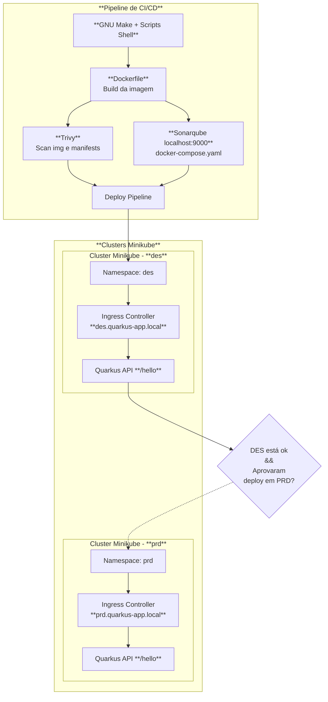

# Deployment Automatizado de Aplicação Quarkus em Ambiente Orquestrado Local

Este repositório contém uma solução para o desafio técnico de **implantação automatizada em ambiente orquestrado**, com foco em práticas de **DevSecOps**.

A aplicação escolhida foi baseada no projeto [quarkus-getting-started](https://github.com/quarkusio/quarkus-quickstarts/tree/main/getting-started). Ao código original, foram aplicadas algumas adaptações e melhorias para suportar Swagger/OpenAPI Specification, health check, análise estática com SonarQube e deployment em cluster kubernetes.

## Documentos Importantes

> Os Links abaixo levam para documentos presentes no diretório **`docs/`**. Visite-os para entender os requisitos, como preparar o ambiente, como é o versionamento, como executar a pipeline localmente e como validar a aplicação.
>
> - [1. Requisitos](./docs/01-requisitos.md)
> - [2. Instalação e Setup do Ambiente](./docs/02-instalacao-setup-ambiente.md)
> - [3. Versionamento, Etapas e Execução da Pipeline](./docs/03-pipeline.md)
> - [4. Validação da Aplicação](./docs/04-validacao.md)
> - [5. Execução local](./docs/05-rodar-localmente.md)

## Tecnologias Utilizadas

| Ferramenta     | Descrição                                                                          |
| -------------- | ---------------------------------------------------------------------------------- |
| **Docker**     | Build e versionamento de imagens de container                                      |
| **Minikube**   | Cluster Kubernetes local para testes, validação e ambientes des e prd              |
| **Kubectl**    | CLI oficial para interagir com clusters Kubernetes/Minikube                        |
| **Kustomize**  | Gerenciamento de sobreposições e personalização de manifests k8s                   |
| **GNU Make**   | Simular pipeline local, invocando scripts shell em sequência (build, deploy, etc.) |
| **Trivy**      | Scanner de vulnerabilidades em imagens Docker e arquivos de manifests k8s          |
| **SonarQube**  | Análise estática de qualidade de código e relatórios de cobertura                  |
| **Java (JDK)** | Linguagem de programação e JDK para compilar e executar aplicações Java            |
| **Maven**      | Gerenciador de build e dependências para projetos Java                             |
| **Quarkus**    | Framework Java para microsserviços, ideal para k8s                                 |

## Entregáveis do Desafio

- Cluster Kubernetes local provisionado (**Minikube**)
- Pipeline local de automação (Makefile + scripts bash)
- Aplicação **Quarkus** compilada e empacotada
- Imagem de container Docker (base Eclipse Temurin)
- Deploy da aplicação nos ambientes:
  - **DES** (Desenvolvimento)
  - **PRD** (Produção simulado)
- Documentação técnica detalhada

## Visão Geral da Solução

O diagrama abaixo, criado com a sintaxe do [Mermaid](https://mermaid.js.org/), apresenta de forma clara os principais componentes e fluxos de implantação da solução, ajudando no entendimento da arquitetura como um todo.

[⬆️ Ver Documentos Importantes](#documentos-importantes)
