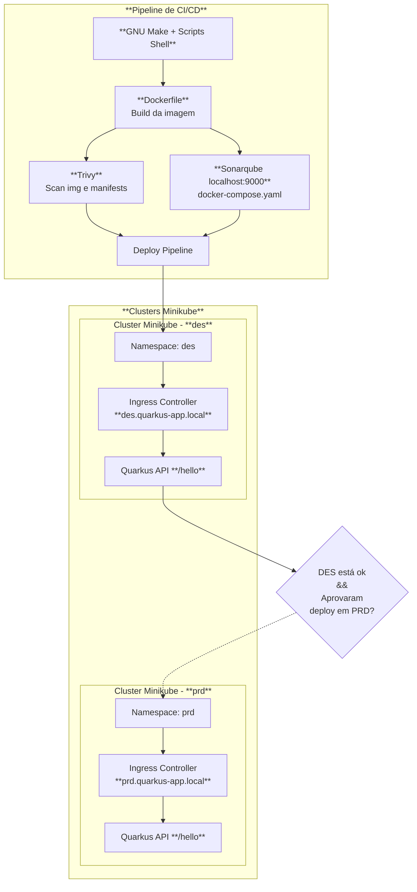
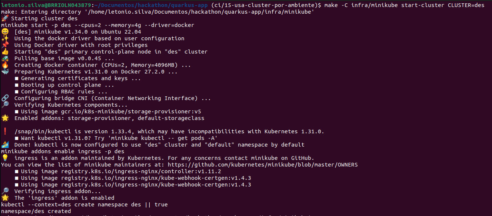
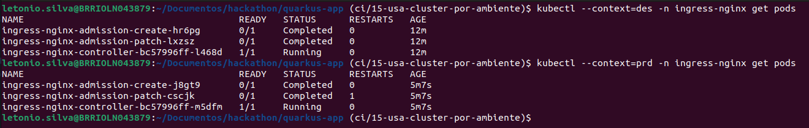
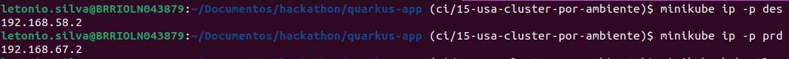
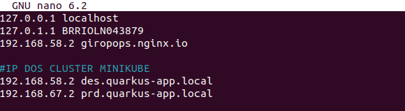
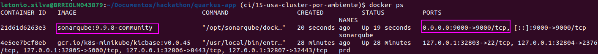
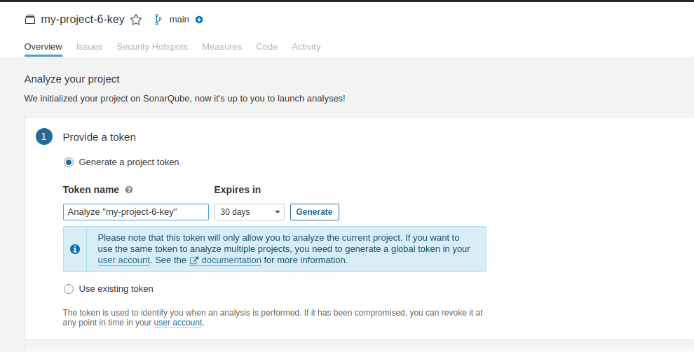

[⬅️ Voltar para o README](../README.md#requirements#estrutura-da-documentação)

# 2. Instalação e Setup do Ambiente

O diagrama abaixo, criado com a sintaxe do [Mermaid](https://mermaid.js.org/), apresenta de forma clara os principais componentes e fluxos de implantação da solução, ajudando no entendimento da arquitetura como um todo.



## 2.1. Instalação de ferramentas

As principais ferramentas podem ser instaladas manualmente ou via gerenciador de pacotes. Links oficiais:

- [Java (Temurin JDK)](https://adoptium.net/pt-BR/temurin/releases?version=21)
- [Maven](https://maven.apache.org/install.html)
- [Docker](https://docs.docker.com/engine/install/ubuntu/)
- [Minikube](https://minikube.sigs.k8s.io/docs/start/)
- [Kubectl](https://kubernetes.io/docs/tasks/tools/)
- [Kustomize](https://kubectl.docs.kubernetes.io/installation/kustomize/)
- [Act](https://nektosact.com/installation/)
- [GNU Make](https://www.gnu.org/software/make/#download)
- [jq](https://jqlang.org/download/)

### 2.1.1. Verificação das versões instaladas:

Para verificar se as ferramentas estão instaladas, aplique os comandos abaixo:

```bash
java --version
mvn --version
docker --version
minikube version
kubectl version
kustomize version
act --version
make --version
jq --version
```

Depois de instalar as ferramentas, a próxima etapa é configurar alguns elementos fundamentais para a infraestrutura, são eles:

- **Minikube**
  - Inicializar cluster Minikube do ambiente de **des**;
  - Inicializar cluster Minikube do ambiente de **prd**;
  - Instalar o **ingress** no cluster de des e de **prd**;
  - Mapear os IPs de cada cluster para o domínio correspondente e salvar em **/etc/hosts**.
- **Sonarqube server**
  - Executar um container com Sonarqube server
  - Acessar [http://localhost:9000](http://localhost:9000) para criar **project-key** e gerar **token**
- Configurar **.env** com as variáveis de ambiente

## 2.2. Configuração do Minikube

Para aproveitar o engine do Docker já instalado, evitando a criação de uma VM separada, o minikube permite passar o driver do docker ao aplicar o comando de iniciar o cluster. Essa flag, bem como outros comandos que permitem gerenciar o ciclo de vida dos clusters, foram incluídos em `infra/minikube/Makefile`.

Para iniciar os clusters de **des** e **prd**, instalar o addon **ingress** e criar um namespace para cada um, a partir da raiz do projeto, aplique esses comandos:

```bash
# supondo que esteja na raiz do projeto
make -C infra/minikube start-cluster CLUSTER=des
make -C infra/minikube start-cluster CLUSTER=prd
```


Aplicar o comando acima é equivalente a aplicar esses comandos:

```bash
minikube start -p $(CLUSTER) --cpus=2 --memory=4g --driver=docker
minikube addons enable ingress -p $(CLUSTER)
kubectl --context=$(CLUSTER) create namespace $(NAMESPACE) || true
```

Ao habilitar o addon **Ingress**, o Minikube instala automaticamente um controller (por exemplo, NGINX) e configura tudo. O Ingress atua como um roteador HTTP/HTTPS dentro do cluster, permitindo expor múltiplos services em um único endereço IP, usando regras de host e path. Para conferir se o ingress de cada cluster está funcionando adequadamente, aplique esses comandos:

```bash
kubectl --context=des -n ingress-nginx get pods
kubectl --context=prd -n ingress-nginx get pods
```

A flag `--context` serve para indicar em qual cluster você deseja obervar.


## 2.3. Configuração de DNS local (hosts)

### 2.3.1. Determinar os IPs dos clusters

O IP de cada cluster Minikube é usado para expor services do tipo **NodePort** e **LoadBalancer**. No caso de driver Docker, trata-se do IP da rede interna do container que simula o node. Precisamos desses IPs para fazer a associação de DNS local. Aplique o comando a seguir:

```bash
minikube ip -p des
minikube ip -p prd
```



A flag `-p` (`--profile`) indica qual cluster você deseja obter o ip.

### 2.3.2. Adicionar os IPs no arquivo de hosts

Nesse desafio, temos dois ambientes (des e prd), os manifests de kubernetes (ver k8s/overlays/des e k8s/overlays/prd) definem os domínios:

- `des.quarkus-app.local`
- `prd.quarkus-app.local`

O ingress de cada cluster será responsável por direcionar requisições para os serviços correspondentes. No entanto, para que a resolução de DNS local aconteça, precisamos associar esses domínios ao IP de cada cluster no arquivo de hosts.

Adicione os IPs no arquivo de hosts (`/etc/hosts`). Abra o arquivo com o comando abaixo:

```bash
sudo nano /etc/hosts
```

Adicione os domínios:

```bash
<IP_DO_MINIKUBE_DES>  des.quarkus-app.local
<IP_DO_MINIKUBE_PRD>  prd.quarkus-app.local
```

Por exemplo,

```bash
192.168.58.2   des.quarkus-app.local
192.168.67.2   prd.quarkus-app.local
```

Salve as mudanças (você pode aplicar `sudo cat /etc/hosts` para confirmar que o arquivo está atualizado).



Dessa forma, as requisições para http://des.quarkus-app.local e http://prd.quarkus-app.local são convertidas para o IP, com a informação de host, e o Ingress responsável daquele cluster roteará para os respectivos destinos.

## 2.4. SonarQube server

No pipeline local, uma das etapas é a análise estática de código usando **Sonarqube**. Portanto, é obrigatório subir uma instância de sonarqube localmente. Para isso, vamos fazer uso de imagem docker de sonarqube community (versão da comunidade), a saber **`sonarqube:9.9.8-community`**([Docker hub sonarqube](https://hub.docker.com/_/sonarqube/)).

### 2.4.1. Subir instância do Sonarqube

Para subir SonarQube localmente, é possível aplicar esse comando:

```bash
docker run -d --name sonarserver -p 9000:9000 sonarqube:9.9.8-community
```

Alternativamente, você pode usar o `docker-compose.yaml` disponível em **`./infra/sonar-server/docker-compose.yaml`**. Basta abrir o terminal na raiz do projeto e aplicar o comando abaixo:

```bash
# supondo terminal na raiz do projeto
docker compose \
  -f infra/sonar-server/docker-compose.yaml \
  -p sonarserver up -d
```

Obs.: Caso o terminal esteja posicionado no diretório **infra/sonar-server** (`cd infra/sonar-server`), é suficiente rodar:

```bash
# supondo terminal posicionado em infra/sonar-server
docker compose -p sonarserver up -d
```

A principal vantagem de usar o arquivo docker-compose.yaml é que ele cria volumes para a persistência dos dados das análises.
Lembre-se de verificar se o container está ativo:

```bash
docker ps
```



Ao final do desenvolmento, o usuário pode derrubar o container por meio desse comando:

```bash
docker compose -p sonarserver down
```

### 2.4.2. Configurar usuário e obter token

Com o servidor do Sonarqube disponível, acesse [http://localhost:9000](http://localhost:9000).
As credenciais são

```
usuario: admin
senha: admin
```

Pode ser solicitado a troca de senha após o primeiro login.
Siga esse passo a passo:

1. Clique em **Create Project**
1. Clique em **Manually**
1. No formulário apresentado, defina uma `project-key` e a branch default.
1. Clique em **Set Up**
1. Na página seguinte, clique em **Locally**
1. Clique no botão **Generate** para criar um token de autenticação (`project token`).



Após esses passos, você deve obter algo similar a isso:

```
Analyze "my-project-key": sqp_fb84a3bcfdaffa9bd62a91c2cbf9fca22e4fcad0
```

Nesse caso, `my-project-key` é a chave, e `sqp_fb84a3bcfdaffa9bd62a91c2cbf9fca22e4fcad0` é o token do projeto. Essas informações devem ser adicionadas em um arquivo `.env`, conforme explicado no próximo item.

Posteriormente, quando o pipeline for executado, uma das etapas faz analise de código e envia o relatório de cobertura para o Sonarqube, disponível em [http://localhost:9000](http://localhost:9000).

# 2.5. Configurar arquivo com variáveis de ambiente

Na raiz do projeto, há um arquivo nomeado `.env.example` que contém um modelo de todas as variáveis necessárias para executar a pipeline.
Crie uma cópia desse arquivo e, em seguida, renomei a cópia para `.env`. No `.gitignore` está listado o `.env`, portanto, não é um arquivo que será enviado para o repositório remoto. O conteúdo original do arquivo é parecido com este:

```bash
SONAR_SERVER=http://<sonar-host-server>:<port>
SONAR_PROJECT_KEY=<project-key>
SONAR_TOKEN=<token>
ALLOW_PRD_DEPLOYMENT=<boolean>
IMAGE_NAME=<image-name>
```

Substitua o valores entre `< >` pelo real valor da variável. Por exemplo, no item anterior você criou uma **project key** e um **project token**. Esses valores devem ser adicionados no `.env`. Em seguida, apresenta-se uma descrição resumida de cada variável:

- **`SONAR_SERVER` -** Host do servidor do sonar. É comum adotar `http://localhost:9000`
- **`SONAR_PROJECT_KEY` -** Project key definida no servidor do sonar
- **`SONAR_TOKEN` -** Project token definido no servidor do sonar, no formato **sqp_hash**
- **`ALLOW_PRD_DEPLOYMENT` -** Variável booleana que indica se deve ser feito o deploy em prd (caso não esteja definida, a pipeline usa valor `false` como padrão
- **`IMAGE_NAME` -** Nome da imagem, desconsiderando a tag (caso não esteja definida, a pipeline usa `quarkus-app`)

> **Atenção, insira as informações SEM aspas!**

Para ilustrar um exemplo de `.env` devidamente preenchido, observe abaixo:

```bash
SONAR_SERVER=http://localhost:9000
SONAR_PROJECT_KEY=my-project-key
SONAR_TOKEN=sqp_fb84a3bcfdaffa9bd62a91c2cbf9fca22e4fcad0
ALLOW_PRD_DEPLOYMENT=true
IMAGE_NAME=quarkus-app
```

Com o ambiente corretamente configurado, a próxima etapa é conhecer e executar a pipeline.

---

[⬅️ Voltar para o README](../README.md#requirements#estrutura-da-documentação)

[⬅️ Anterior: 1. Requisitos](./01-requisitos.md)

[➡️ Próximo: 3. Versionamento, Etapas e Execução da Pipeline](./03-pipeline.md)
