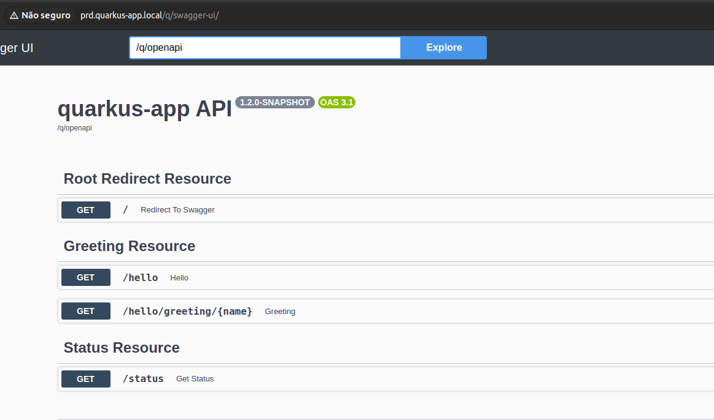
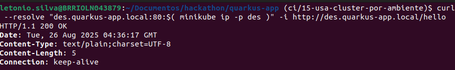
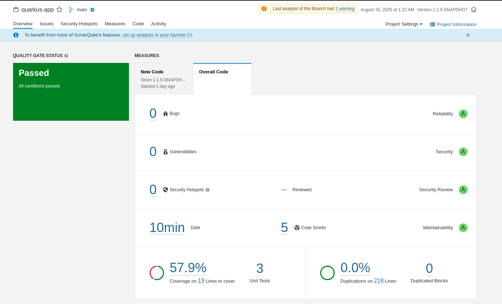

[⬅️ Voltar para o README](../README.md#requirements#estrutura-da-documentação)

# 4. Validação da Aplicação

Conforme explicado anteriormente, esse é o comando que dispara a pipeline

```bash
make pipeline
```

Caso ela seja executada com sucesso, ao final do processo teremos a aplicação disponível nos ambientes de desenvolvimento e produção (se a "aprovação manual" indicar que deve ser feito em prd também).

## 4.1. Testar endpoints

Abra o navegador e acesse a raiz do domínio. Como o projeto original não tinha rota raiz, o autor optou por adicionar um redirecionamento, que leva para o endpoint do Swagger. Além disso, também foi habilitado um endpoint de health check, conforme mostrado a seguir:

- **Swagger UI**:
  ```
  # usar http://des.quarkus-app.local leva para:
  http://des.quarkus-app.local/q/swagger-ui
  http://prd.quarkus-app.local/q/swagger-ui
  ```
- **Healthcheck**:

  ```bash
  http://des.quarkus-app.local/q/health
  http://prd.quarkus-app.local/q/health
  ```

- Fique à vontade para exploras outros endpoints:

      ```bash
      http://des.quarkus-app.local/hello
      http://prd.quarkus-app.local/hello
      ```



Por conta do docker, caso deseje usar curl, em vez de acessar pelo navegador, a sintaxe é um pouco maior (ver [Documentação minikube](https://kubernetes.io/docs/tasks/access-application-cluster/ingress-minikube/) ):

```bash

curl --resolve "des.quarkus-app.local:80:$( minikube ip -p des )" \
    -i http://des.quarkus-app.local/hello
curl --resolve "prd.quarkus-app.local:80:$( minikube ip -p prd )" \
    -i http://prd.quarkus-app.local/hello
```



## 4.2. Verificar o status dos pods

Para visualizar os pods de des e prd, aplica-se, respectivamente, os comandos a seguir:

```bash
kubectl --context=des -n des get pods
kubectl --context=prd -n prd get pods
```

A saída deve ser parecida com:

```bash
NAME READY STATUS RESTARTS AGE
quarkus-app-des-78c4888cf7-wfxj4 1/1 Running 0 97s
```

## 4.3. Verificar logs da aplicação

Sabendo o nome do pod, podemos consultar os logs:

```bash
kubectl --context=des -n des logs quarkus-app-des-<hash>
kubectl --context=prd -n prd logs quarkus-app-prd-<hash>
```

## 4.4. Verificação de versão da imagem

Podemos confirmar a versão que está sendo empregada

```bash
kubectl --context=des  describe pod -n des | grep Image:
```

Um exemplo de retorno esperado é mostrado a seguir:

```bash
Image:          quarkus-app:1.1.0-SNAPSHOT-fd76ba1
```

## 4.5. Vizualizar relatório de análise

Acesse o servidor do sonarqube em [http://localhost:9000](http://localhost:9000) e procure pelo projeto quarkus-app. Espera-se algo similar a isso:


---

[⬅️ Voltar para o README](../README.md#requirements#estrutura-da-documentação)

[⬅️ Anterior: 3. Etapas e Execução da Pipeline](./03-pipeline.md)

[➡️ Próximo: 5. Execução local da aplicação Quarkus](./05-rodar-localmente.md)
